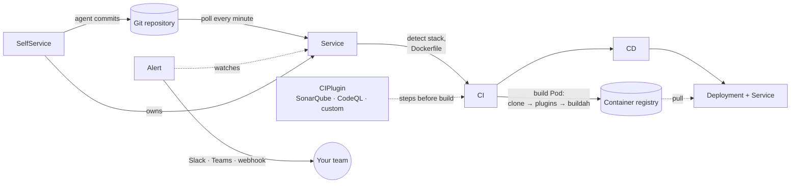

# Koptan

Koptan is a Kubernetes operator that builds and deploys applications straight from a git repository. You give it a repository URL. Koptan works out how to build it, builds a container image inside your cluster, pushes the image to your registry and runs it as a Deployment. When you push new commits, it does all of this again.

You do not write a Dockerfile, a CI pipeline or deployment manifests. If your repository already has a Dockerfile, Koptan uses it.

## What you get

| Feature | Resource | What it does |
|---|---|---|
| **Build and deploy from git** | [`Service`](resources/service.md) | Watches a repository, detects the stack (Go, Rust, Java, .NET, Python, Ruby, PHP, Node.js or static sites), builds the image and deploys it. |
| **Builds** | [`CI`](resources/ci.md) | Created for you. Builds one image per commit in a Pod and pushes it to the registry. |
| **Deployments** | [`CD`](resources/cd.md) | Created for you. Runs the image as a Deployment with a Kubernetes Service in front of it. |
| **CI steps** | [`CIPlugin`](resources/ciplugin.md) | Adds steps that run before the build, such as SonarQube, CodeQL, Trivy or any container you choose. |
| **Notifications** | [`Alert`](resources/alert.md) | Sends pushes, builds and deployments to Slack, Microsoft Teams or a signed webhook. |
| **AI self-service** | [`SelfService`](resources/selfservice.md) | Pairs a repository with an AI agent. Each prompt becomes a commit, and Koptan builds and deploys it. |
| **Web UI** | [Koptan UI](ui/overview.md) | A Backstage-based UI for creating and following all of the above. |

## How it works

1. You create a **Service** that points at a repository.
2. Koptan clones the repository at the latest commit. It uses your Dockerfile, or it generates one for the detected stack.
3. Koptan creates a **CI**, which builds and pushes the image in a build Pod. Any **CIPlugins** attached to the Service run first, after checkout and before the build.
4. When the build succeeds, Koptan creates a **CD**, which rolls out a Deployment and a Kubernetes Service on port 80.
5. Koptan checks the repository every minute. A new commit starts the cycle again.

You only create the `Service`. Koptan creates the `CI` and `CD` and keeps them up to date.

## Where to start

- [Prerequisites](getting-started/prerequisites.md): what your cluster needs.
- [Installation](getting-started/installation.md): install the operator and the UI with Helm.
- [Quickstart](getting-started/quickstart.md): deploy your first application in five minutes.
- [Helm charts](helm/koptan.md): every chart setting.
- [Troubleshooting](reference/troubleshooting.md): what to do when something fails.

## API at a glance

All resources are in the API group `koptan.felukka.org/v1` and are namespaced.

| Kind | Plural | Short name | Created by |
|---|---|---|---|
| `Service` | `services.koptan.felukka.org` | `ksvc` | You |
| `CI` | `cis` | — | Koptan |
| `CD` | `cds` | — | Koptan |
| `CIPlugin` | `ciplugins` | `cip` | You |
| `Alert` | `alerts` | — | You |
| `SelfService` | `selfservices` | `kss` | You |

!!! tip "Use `ksvc`, not `service`"
    `kubectl get services` lists core Kubernetes Services. To list Koptan Services, use `kubectl get ksvc` or `kubectl get services.koptan.felukka.org`.
