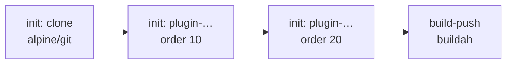

# CI

A **CI** builds a container image from one commit and pushes it to a registry.

- **API:** `koptan.felukka.org/v1`, kind `CI`
- **Plural:** `cis` (`kubectl get cis`)
- **Created by:** Koptan, from a [Service](service.md). Its name is `<service>-ci`.
- **Creates:** one build Pod per commit, and the [CD](cd.md) `<service>-cd` after the first successful build

!!! info "You do not create CIs"
    Koptan creates and updates the CI from the Service. Change the Service instead. Manual edits to the CI are overwritten. This page explains what the CI does, so you can follow and debug builds.

## How a build works

Koptan builds each commit once. It starts a new build when the commit changes, or when the CI spec changes (for example, a new Dockerfile or a changed CIPlugin). Each build runs in a Pod named `<service>-ci-build-<random>`, in the Service's namespace:



| Container | Image | What it does |
|---|---|---|
| `clone` (init) | `alpine/git:2.47.2` | Fetches exactly the commit into `/workspace`. For private repositories it uses the token from `source.secretRef` (HTTPS URLs). |
| `plugin-<name>` (init, one per plugin) | Set by the plugin | Runs the [CIPlugins](ciplugin.md) in `order`. A failing plugin with `failurePolicy: Fail` stops the build. |
| `build-push` | `quay.io/buildah/stable:v1.43.0` | Builds the Dockerfile from the Service's ConfigMap in the build context, then pushes the image. Rootless, `vfs` storage, no privileged mode. |

The image is `<registry>/<repo>:<first 12 characters of the SHA>`.

## Following a build

```bash
kubectl get cis
```

```
NAME                 PHASE       IMAGE                                       REVISION     BUILDS   AGE
example-service-ci   Succeeded   ghcr.io/example/repo:3f9c2a1b7d4e           3f9c2a1b…    4        2d
```

Logs of the current or latest build:

```bash
POD=$(kubectl get ci example-service-ci -o jsonpath='{.status.buildPod}')
kubectl logs "$POD" -c clone
kubectl logs "$POD" -c plugin-trivy-fs     # one per plugin
kubectl logs -f "$POD" -c build-push
```

When a build fails, the end of the failing container's log (up to 1,500 characters) is copied to `status.message`, so `kubectl describe ci` often shows the error directly.

## Status reference

| Field | Description |
|---|---|
| `phase` | `Idle`, `Resolving`, `Building`, `Succeeded` or `Failed`. |
| `latestRevision` | SHA of the last commit built successfully. |
| `latestImage` | The image pushed by the last successful build. |
| `buildCount` | Number of builds so far. |
| `lastBuildTime` | When the last build finished. |
| `buildPod` | The Pod running, or that last ran, a build. |
| `buildingRevision` | The commit being built in `buildPod`. |
| `pluginResults` | One entry per plugin step of the latest build, in order: `name`, `phase` (`Pending`, `Running`, `Succeeded`, `Failed`) and `message`. |
| `message` | Progress, or the reason the build failed. |
| `conditions` | Standard conditions. |

## Spec reference (read-only)

These fields are set by Koptan from the Service.

| Field | Description |
|---|---|
| `service.name` | The Service this CI builds. |
| `image.registry` | Registry host. Default `docker.io`. |
| `image.repo` | Image repository. |
| `image.credentialsSecret` | dockerconfigjson Secret used to push. |
| `image.loginSecret` | **Deprecated.** Inline `username` / `password`. Converted into a Secret named `<ci>-registry`. Use `credentialsSecret`. |
| `revision` | Full commit SHA to build. |
| `dockerfileConfigMap` | ConfigMap with the `Dockerfile` key and, optionally, `.dockerignore`. |
| `contextDir` | Build context relative to the repository root. |
| `plugins` | CIPlugins to run, each pinned to the plugin's `generation`, so editing a plugin triggers a rebuild. |
| `extraSteps` | Extra containers. Reserved; not set by Koptan. |

## Deleting

The CI is owned by its Service and is deleted with it. Deleting a CI by hand deletes its build Pods and its CD; Koptan creates a new CI on the Service's next check.
