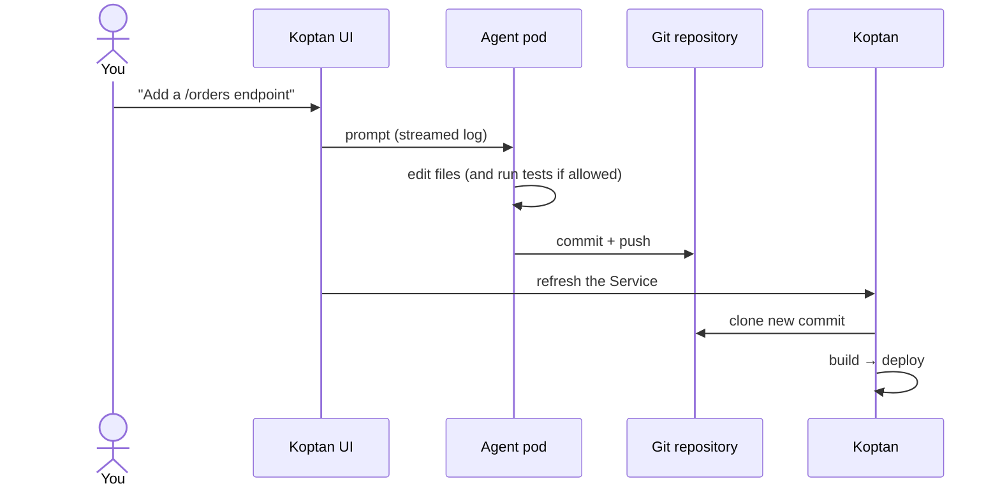

# SelfService

A **SelfService** pairs a git repository with an AI coding agent. You describe what you want in plain language. The agent writes the code and commits it to the repository, and Koptan builds and deploys each commit like any other [Service](service.md).

- **API:** `koptan.felukka.org/v1`, kind `SelfService`
- **Short name:** `kss` (`kubectl get kss`)
- **Creates:** the repository (optional), an agent Deployment and Service named `<name>-agent`, a Secret `<name>-agent`, and a Koptan [Service](service.md) named `<name>`



## Before you start

1. The operator needs the **agent key**. See [Installation, step 2](../getting-started/installation.md#2-create-the-agent-key-for-selfservices). Without it, SelfServices fail with `the operator has no agent key (KOPTAN_AGENT_KEY); SelfServices are disabled`.
2. The [Koptan UI](../ui/overview.md) must have the same key, to send prompts. The `koptan-ui` chart reads it from the same Secret when installed in the operator namespace.
3. You need a **git token** that can push (and create repositories, if Koptan should create one).
4. You need an **AI model**: an Anthropic API key, or an OpenAI-compatible server (OpenAI, Azure OpenAI, OpenRouter, LiteLLM, or a local server such as Ollama, vLLM or LM Studio).

## Example

```bash
kubectl create secret generic shop-git --from-literal=token=ghp_...
kubectl create secret generic shop-ai --from-literal=apiKey=sk-ant-...
```

```yaml
apiVersion: koptan.felukka.org/v1
kind: SelfService
metadata:
  name: shop
  namespace: default
spec:
  repo:
    # The operator creates the repository (GitHub or GitLab)...
    create:
      provider: github
      owner: example-org
      private: true
      tokenSecretRef: {name: shop-git, key: token}
    # ...or the agent works on one that exists (it may be empty):
    # existing:
    #   url: https://github.com/example-org/shop.git
    #   secretRef: {name: shop-git, key: token}
  branch: main
  ai:
    provider: anthropic
    model: claude-opus-5-5
    apiKeySecretRef: {name: shop-ai, key: apiKey}
    # Or any OpenAI-compatible server, e.g. a local Ollama (no key needed):
    # provider: openai-compatible
    # baseURL: http://ollama.ollama.svc:11434/v1
    # model: qwen2.5-coder:14b
  # Lets the agent run tests and formatters inside its pod.
  allowCommands: false
  # The Service created for the repository.
  service:
    port: 8080
    replicas: 1
```

```bash
kubectl apply -f selfservice.yaml
kubectl get kss shop -w
```

When the phase is `Ready`, open the **Self Service** page in the UI, pick `shop` and send a prompt, for example *"Create a FastAPI service with a /orders endpoint backed by an in-memory list"*.

## The repository

Set exactly one of `repo.existing` or `repo.create`.

### An existing repository

```yaml
repo:
  existing:
    url: https://github.com/example-org/shop.git
    secretRef: {name: shop-git, key: token}
```

- The URL must be `https`.
- The token must be able to push to `branch`.
- The repository may be empty. The agent makes the first commit.

### Let Koptan create it

```yaml
repo:
  create:
    provider: gitlab                       # github or gitlab
    owner: platform/apps                   # org/user on GitHub, group path on GitLab; empty = token's account
    name: shop                             # default: the SelfService name
    private: true                          # default: true
    baseURL: https://gitlab.example.com/api/v4   # GitHub Enterprise or self-hosted GitLab only
    tokenSecretRef: {name: shop-git, key: token}
```

The token needs permission to create repositories and push. Repository URL is reported in `status.repoURL`.

## The AI model

| Provider | `provider` | `baseURL` | Key |
|---|---|---|---|
| Anthropic (Claude) | `anthropic` | not used | Required |
| OpenAI | `openai-compatible` | `https://api.openai.com/v1` | Required |
| OpenRouter, LiteLLM, Azure OpenAI, Gemini (OpenAI endpoint) | `openai-compatible` | The provider's `/v1` URL | Usually required |
| Ollama in the cluster | `openai-compatible` | `http://ollama.<ns>.svc:11434/v1` | Not needed |
| vLLM, LM Studio, llama.cpp server | `openai-compatible` | The server's `/v1` URL | Usually not needed |

Models that support tool calling edit files directly. For models without tool calling, the agent falls back to a plan mode, where the model returns the files to write. Larger code models give better results; small local models work for simple changes.

## Agent commands

With `allowCommands: true`, the agent can run shell commands in its pod, such as installing dependencies, running tests or formatters. With `false` (default), it can only read and write files in the repository.

The agent pod is locked down either way: non-root (UID 1000), read-only root filesystem, no service account token, all capabilities dropped. Its workspace is an `emptyDir`, so a restarted agent clones the repository again. Git history is the durable record of what the agent did.

## What Koptan creates

| Object | Name | Purpose |
|---|---|---|
| Secret | `<name>-agent` | The agent's API token. The git token and AI key are read from your own Secrets. |
| Deployment | `<name>-agent` | One agent pod (`replicas: 0` while suspended). Resources: 100m / 256Mi requested, 1 CPU / 1Gi limit. |
| Service (core) | `<name>-agent` | The agent API on port 8080, in-cluster only. |
| Service (Koptan) | `<name>` | Builds and deploys the repository's `branch`. Takes `image`, `replicas`, `port`, `env` and `plugins` from `spec.service`. |

If a Koptan Service with the same name already exists and does not belong to this SelfService, the SelfService fails instead of taking it over.

After each agent run that pushes a commit, the UI annotates the Koptan Service so that it builds right away.

## Spec reference

| Field | Type | Required | Default | Description |
|---|---|---|---|---|
| `repo.existing.url` | `https://` URL | One of `existing` / `create` | — | Clone URL. |
| `repo.existing.secretRef` | `{name, key}` | with `existing` | — | Token that can push. |
| `repo.create.provider` | `github` / `gitlab` | with `create` | — | Where to create the repository. |
| `repo.create.owner` | string | No | Token's account | Org/user, or GitLab group path. |
| `repo.create.name` | string | No | SelfService name | Repository name (1–100 characters). |
| `repo.create.private` | bool | No | `true` | Private repository. |
| `repo.create.baseURL` | `https://` URL | No | github.com / gitlab.com | API URL of GitHub Enterprise or a self-hosted GitLab. |
| `repo.create.tokenSecretRef` | `{name, key}` | with `create` | — | Token that can create repositories and push. |
| `branch` | string | No | `main` | Branch the agent commits to and the Service builds. |
| `ai.provider` | `anthropic` / `openai-compatible` | **Yes** | — | Model API. |
| `ai.model` | string | **Yes** | — | Model ID, such as `claude-opus-5-5` or `llama3.1`. |
| `ai.baseURL` | string | No | — | Base URL of an OpenAI-compatible server. |
| `ai.apiKeySecretRef` | `{name, key}` | No | — | API key. Local servers usually need none. |
| `service.image` | [ImageSpec](service.md#image) | No | Operator default registry, SelfService name | Where images are pushed. |
| `service.replicas` | integer | No | `1` | Application replicas. |
| `service.port` | integer | No | `8080` | Application port. |
| `service.env` | list of EnvVar | No | — | Application environment. |
| `service.plugins` | list of `{name}` | No | — | [CIPlugins](ciplugin.md) for the builds. |
| `allowCommands` | bool | No | `false` | Let the agent run shell commands. |
| `agentImage` | string | No | Operator's agent image | Override the agent image for this SelfService. |
| `suspend` | bool | No | `false` | Scale the agent to zero. The application keeps running. |

## Status

```bash
kubectl get kss
```

```
NAME   PHASE   REPOSITORY                                  MODEL             SERVICE   AGE
shop   Ready   https://github.com/example-org/shop.git     claude-opus-5-5   shop      10m
```

| Field | Description |
|---|---|
| `phase` | `Provisioning`, `Ready` or `Failed`. |
| `repoURL` | Clone URL used by the agent and the Service. |
| `agentService` | In-cluster agent Service (port 8080). |
| `serviceRef` | The Koptan Service that builds and deploys the repository. |
| `message` | Progress or error. |
| `conditions` | Standard conditions. |

## Pausing and deleting

- `kubectl patch kss shop --type merge -p '{"spec":{"suspend":true}}'` stops the agent. The deployed application keeps running.
- `kubectl delete kss shop` deletes the agent, its Secret and the Koptan Service (and with it the deployed application). A repository Koptan created is **not** deleted from GitHub or GitLab.

!!! warning "Who can prompt the agent"
    Anyone who can use the Self Service page can make the agent change the repository, and therefore change what is deployed. Until the UI has real authentication, keep it private. See [Security](../configuration/security.md).
